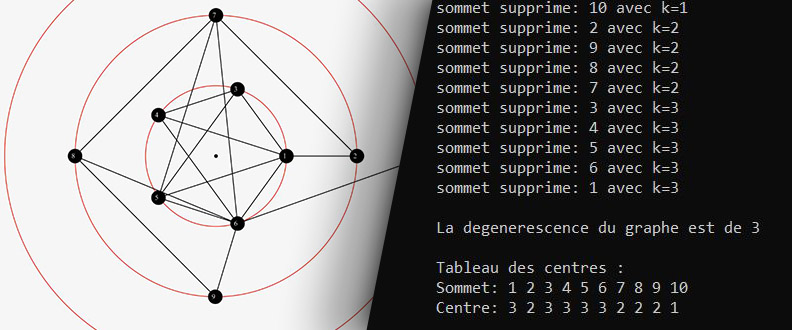

# Project

This is a console program to calculate undirected graph degeneracy and then create a graph based on the values of the k-cores numbers.



This project was made for a 3rd year license study project.

### Features 

- Import of graph from files, each line of these files must describe a link between 2 elements of the graph. You have data files like this in 'data' folder, and you can find more on some websites like [SNAP](http://snap.stanford.edu/data/index.html "") or [KONECT](http://konect.cc/ "").
- Calculation and display of the degeneracy of the graphs, as well as the values of the number k-cores of each vertices.
- Creation of a PostScript file describing the circular drawing of a graph with the vertices having the highest value for the k-core number in the center, and the vertices having the lowest values on the outside.
- If the user's machine is equipped with the `ps2pdf` command, a pdf file is created with the PostScript file.

# Built with 

The project was made in C++.

# Get and use project

### Installation 

1. Clone the repo. 
```
git clone https://github.com/LilianLeVrai/graph_degeneracy.git
```
2. Compile project. 
```
g++ project.cpp -o project
```
4. And run the executable. 
```
./project
```


# Documentation

You can find some documentation (report, testing guide,...) about this project in the 'docs' folder. 
This project being intended for a French professor, so this documentation and the comments of the code are in French and some file or folder names have changed. 


# Contributors 

- [Lilian M.](https://github.com/LilianLeVrai "")
- Pierre A.
